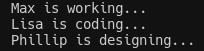

Notes based on: https://www.youtube.com/watch?v=-pEs-Bss8Wc, and intro based on https://www.youtube.com/watch?v=qiSCMNBIP2g

# Section 0 - Introduction

Every object has attributes and behaviors. 
As an object, I know something, as an object, I do something. 
Objects have someway of storing data (variables). Their behaviour are methods - functions 

Think about multiple objects, and how they can be connected - OOP.
A class is a design or blueprint of the object. Objects are instances of a class. 

Classes are their own type! Just as an `int` or `str` is its own type. 

## Section 1 - Classes & Instances

In python primitive data structures are designed to represent simple pieces of information (strings, integers, lists, etc.)

Classes are used for more complex data structures. They contain functions that describe the behaviour of the class.
- a class is a blue print of how something should be defined

```
class SoftwareEngineer: 
#class attributes
    def __init__(self, parameter):
        self.parameter = parameter
    
```
The __init__ method is automatically called each time an instance of a class is created. 

`parameter` is an *instance attribute* that is accessible in a certain instance. 
Class attributes can be used on the class itself - they are the same for each instance. 

You can use the `type` function to check the class of a variable or object 

Summary:
- create a class (blueprint)
- create an instance (object)
- class vs instance difference = class is structure, instance is practical application of the structure
- instance attributes are defined in the __init__(self,...) function

## Section 2 - Functions in Classes

We can use parameters within functions and also return things within the class functions
```
 def code_in_language(self, language):
        print(f"{self.name} is writing code in {language}...")       
```

Special methods (double underscore or d-under methods) start with ``__`` and end with ``__``
These methods are already provided for us in python - all objects have them, they either used the predefined version or user defined version

#### ```__str__```
When the object is printed, the console shows the memory address of the object. To change what gets printed instead, you can modify dunder str method. 
```
def __str__(self):
    return ...
```
For methods within a class that should not be tied to a specific instance, we use [decorators](./decorators.md).
Use the `@staticmethod` decorator to specify that the method is not tied to a specific instance (object of class). Self is not passed to the method, so it is not self referencing. The resulting method can be used on the class and also the instance as follows: 

```
@staticmethod
    def entry_salary(age): 
        if age < 25:
            return 5000
        if age < 30:
            return 7000
        return 9000

print(SoftwareEngineer.entrysalary(27))
print(se2.entry_salary(24))
```

**Note**: since this is not tied to any specific instance, the method cannot access any instance parameters, or self attributes (e.g. self.age)

## Section 3 - Inheritance

Inheritance = one class taking on attributes and methods of another class.
The newly formed class is called the *child class*, while the origin class is called the **parent class**

Methods are automatically inherited by the child class. 
A child class is intialized by passing the parent class as a parameter in its class definition 

```
class Employee: #Parent Class
    def __init__(self, name, age, salary):
        self.name = name
        self.age = age

class SoftwareEngineer(Employee): #Child class
    pass
```
Now when the SoftwareEngineer instance is created, it requires a `name` and `age` parameter to be specified.

Overriding methods in the parent class: 
for example if we want the Software Engineer to have the same attributes (name, age), but additionally we want to include `level` and `salary`, we can do that by overriding the `__init__` method of its parent class.
To override, we just use the same method name and pass in the new functionality we want.
If we require the function from the parent class, we can access it, using the super().method function, and pass in the initial parameters.
Then we can use the `level` and `salary` new parameters as we wish

```
def __init__(self, name, age, level, salary):
    super().__init__(name, age)
    self.level = level
    self.salary = salary
```

### Polymorphism
In greek, this means many shapes. closely related to inheritance.

Gives us a way to use a class, exactly like its parent, but each child class keeps its methods as they are

For example, let's define a list of employees 
```
employees = [Employee("Max", 25, 6000),
             SoftwareEngineer("Lisa", 30, 9000, "Senior"),
             Designer("Phillip", 27, 7000)]
```

Next, we'll create a function that uses the idea of polymorphism to work

```
def motivate_employees(employees):
    for employee in employees:
        employee.work()
```

When we call the function `motivate_employees(employees)`, we see the following output:



*Notice*: 
- employee is a list of Employee instances - though it is mixed withinstances from the child classes SoftwareEngineer and Designer
- Calling the function `work`, refers to the deepest sub-class method:
    - for Max, it is `Employee.work()`
    - for Lisa, it is `SoftwareEngineer.work()`, and
    - for Phillip, it is `Designer.work()`

# Section 4 - Encapsulation & Abstraction

Encapsulation is the mechanism of hiding implementation.
So, instance variables are kept private and there's only one accessor method from the outside to change the instance variables. Therefore, we restrict the access to public methods - getter and setter methods. 

We can set 'private' variables within an class by creating attributes with an underscore as follows:
```
def __init__(self, name, age):
        self.name = name
        self.age = age
        self._salary = 6000 
        self._num_bugs_solved = 0 
```
Note, these can be accessed from the outside, but they shouldn't be. 

To make them totally hidden from outside, we can use a double leading underscore, for example: `self.__salary = 6000` 
If we try to access it, we get an `AttributeError`

We can create public getter and setter functions which access private attributes within the function. We can also create private functions that can be called in getter/setter functions 

Abstraction is a natural extension of encapsulation. It means that each object should only expose the high level mechanism for using it. It should hide internal functions that aren't necessary to be exposed. 

For example, the set_salary function as follows:
```
def set_salary(self, base_value):
    self._salary = self._calculate_salary(base_value)
# the getter and setter should be the only way to access the private attribute, _salary 

def _calculate_salary(self, base_value): 
    if self._num_bugs_solved < 10:
    return base_value
    if self._num_bugs_solved < 100: 
        return base_value * 2
    return base_value * 3 
```

This setter function only calls a private function, it does not expose the details of this function. The calculate salary implementation is abstracted away 


# Properties

There is a more pythonic way of creating getter and setter functions. We use properties to do this by following these two steps:
1. Create a function which has the name of the property you want to set
2. Use the property decorator: @property 
3. Use a setter decorator: @name.setter 
```
@property
def salary():
    return self._salary

@salary.setter
def salary(self, value):
    self._salary = value
``` 
